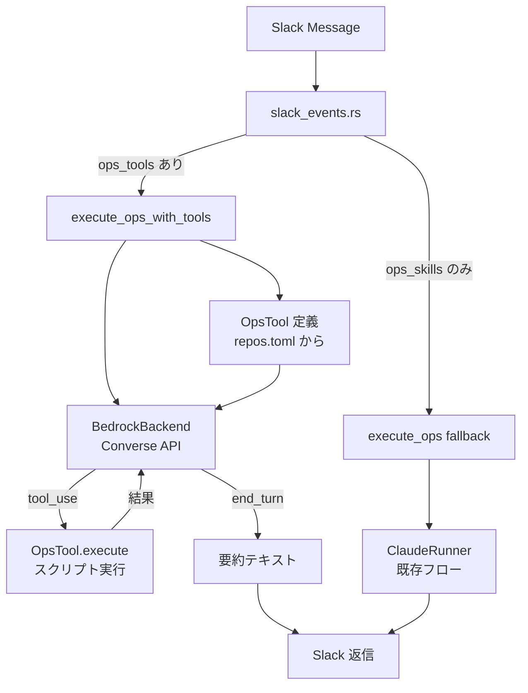

# ops tool ベース再設計

## 1. 現状の問題

### 1.1 現行アーキテクチャ

```
Slack msg
  -> slack_events.rs: ops_channel 判定
  -> ops.rs: skill.md を読み込み system_prompt に注入
  -> ClaudeRunner (BedrockBackend) に渡す
  -> LLM が Read/Write/Edit/Bash/Glob/Grep で "自由に" 作業
  -> 結果を Slack に返信
```

### 1.2 問題点

| 問題 | 詳細 |
|------|------|
| skill = 知識なのに tool として使っている | LLM に毎回 skill.md の手順を読ませ、汎用ツール (Bash, Read, Write...) で自由に実行させている。定型作業なのに毎回「何をすべきか」から推論している |
| 非決定的 | 同じ入力に対して LLM が異なるコマンドを生成する可能性がある |
| コスト過大 | skill.md を system_prompt に含めるトークン量 + 複数ターンのツール呼び出し |
| エラーが LLM 依存 | Bash コマンドのタイポ、パス間違い等が LLM の気分次第 |

### 1.3 理想

ops は「決まった作業」。LLM の役割は:

1. ユーザーの意図を理解する (NLU)
2. 適切な domain-specific tool を呼ぶ (ルーティング)
3. 結果を要約する (要約生成)

LLM が Bash コマンドを自由に組み立てる必要はない。

---

## 2. 設計方針

### 2.1 ADR: skill から tool への転換

**決定**: ops の実行を skill.md ベース (LLM が自由に作業) から tool ベース (LLM が定義済みアクションを呼ぶ) に切り替える。

**根拠**:
- ops は定型作業であり、実行手順はコードに焼き込める
- LLM の役割は意図理解とルーティングに限定すべき
- 決定的な実行 = 安全性・再現性の向上
- トークン消費の削減 (skill.md を system_prompt に含めない)

**トレードオフ**:
- 新しい作業を追加するには Rust コード or スクリプトの変更が必要
- skill.md ベースなら Markdown を書き換えるだけで対応できた
  - -> repos.toml の宣言 + スクリプトファイル配置で対応可能にする設計で軽減

### 2.2 ADR: パラメータ渡し方式

**決定**: tool handler はパラメータを環境変数 `PARAM_xxx` として子プロセスに渡す。

**根拠**:
- シェルインジェクション防止 (コマンド文字列に値を埋め込まない)
- Bash スクリプト側で `$PARAM_NAME` で参照できる
- Python スクリプトでも `os.environ["PARAM_NAME"]` で参照可能
- デバッグしやすい (env で確認可能)

### 2.3 ADR: 後方互換

**決定**: `ops_tools` が設定されていればそちらを使い、なければ `ops_skills` にフォールバック。

**根拠**:
- 段階的移行が可能
- 既存の skill ベースリポジトリを壊さない
- リポジトリごとに移行タイミングを選べる

---

## 3. アーキテクチャ

### 3.1 全体フロー (tool ベース)

```
Slack msg
  -> slack_events.rs: ops_channel 判定
  -> ops.rs: repo の ops_tools 設定を読み込み
  -> BedrockBackend (Converse API) に domain-specific tools を登録
  -> LLM: "ユーザーは foo カテゴリに bar を追加したい"
  -> LLM calls: add_subcategory(name="bar", parent="foo")
  -> tool handler: 定められたコマンドを PARAM_xxx 付きで実行
  -> 結果を LLM に返す (要約生成用)
  -> 要約を Slack に返信
```

### 3.2 レイヤー構成

```
┌───────────────────────────────────────────────────────┐
│  Slack Event (入力)                                    │
│  message in ops_channel                                │
├───────────────────────────────────────────────────────┤
│  Dispatch Layer                                        │
│  slack_events.rs → execute_ops_with_tools()            │
│                  → execute_ops() [fallback]             │
├───────────────────────────────────────────────────────┤
│  Tool Definition Layer                                 │
│  repos.toml の ops_tools 設定                           │
│  → OpsTool 構造体に変換                                 │
│  → Bedrock ToolSpecification に変換                     │
├───────────────────────────────────────────────────────┤
│  LLM Layer (Bedrock Converse API)                      │
│  system_prompt: NLU + tool routing 指示のみ             │
│  tools: domain-specific tools (repos.toml から生成)     │
│  max_turns: 少 (1-3 ターン想定)                         │
├───────────────────────────────────────────────────────┤
│  Tool Execution Layer                                  │
│  OpsTool.execute() → スクリプト実行                      │
│  パラメータ: PARAM_xxx 環境変数で渡す                    │
│  cwd: repo_path                                        │
│  タイムアウト: tool ごとに設定可能                        │
├───────────────────────────────────────────────────────┤
│  Response Layer                                        │
│  LLM が tool 結果を要約 → Slack に返信                   │
└───────────────────────────────────────────────────────┘
```

### 3.3 コンポーネント図



---

## 4. データ設計

### 4.1 repos.toml の拡張

```toml
[[repo]]
key = "send_survey_mail"
github = "amu-tazawa-scripts/send_survey_mail"
ops_channel = "C_SURVEY"

# 新方式: tool ベース
[[repo.ops_tools]]
name = "add_subcategory"
description = "アンケートのサブカテゴリを追加する"
command = ".claude/scripts/add-subcategory.sh"
timeout_secs = 30

[repo.ops_tools.params.name]
type = "string"
description = "追加するサブカテゴリ名"
required = true

[repo.ops_tools.params.parent]
type = "string"
description = "親カテゴリ名"
required = true

[[repo.ops_tools]]
name = "list_categories"
description = "現在のカテゴリ一覧を表示する"
command = ".claude/scripts/list-categories.sh"
timeout_secs = 10

# 旧方式 (フォールバック): skill ベース
# ops_skills = [".claude/skills/add-subcategory/SKILL.md"]
```

### 4.2 Rust 型定義

```rust
// repo_config.rs に追加

#[derive(Debug, Clone, Deserialize)]
pub struct OpsToolDef {
    /// Bedrock tool_use で使われる名前 (snake_case)
    pub name: String,
    /// LLM に表示する説明
    pub description: String,
    /// 実行するコマンド (repo_path からの相対パス)
    pub command: String,
    /// コマンドのタイムアウト (秒)
    #[serde(default = "default_tool_timeout")]
    pub timeout_secs: u64,
    /// パラメータ定義 (name -> ParamDef)
    #[serde(default)]
    pub params: IndexMap<String, ParamDef>,
}

fn default_tool_timeout() -> u64 {
    30
}

#[derive(Debug, Clone, Deserialize)]
pub struct ParamDef {
    /// JSON Schema の型 ("string", "integer", "boolean")
    #[serde(rename = "type")]
    pub param_type: String,
    /// LLM に表示する説明
    pub description: String,
    /// 必須パラメータか
    #[serde(default)]
    pub required: bool,
}
```

### 4.3 RepoEntry の拡張

```rust
#[derive(Debug, Clone, Deserialize)]
pub struct RepoEntry {
    pub key: String,
    pub github: String,
    #[serde(default = "default_branch")]
    pub default_branch: String,
    #[serde(rename = "match")]
    pub match_rule: Option<MatchRule>,
    #[serde(default)]
    pub allowed_tools: Option<Vec<String>>,
    pub max_execute_turns: Option<u32>,
    pub ops_channel: Option<String>,
    // 既存: skill ベース (フォールバック)
    #[serde(default)]
    pub ops_skills: Option<Vec<String>>,
    // 新規: tool ベース (優先)
    #[serde(default)]
    pub ops_tools: Option<Vec<OpsToolDef>>,
}
```

---

## 5. コンポーネント設計

### 5.1 ops.rs の変更

```rust
// ops.rs

/// tool ベースで ops を実行 (ops_tools が設定されている場合)
pub async fn execute_ops_with_tools(
    req: &OpsRequest,
    repo_path: &Path,
    tools: &[OpsToolDef],
    soul: &str,
    max_turns: u32,
    log_dir: Option<&Path>,
    runner_ctx: &RunnerContext,
    history: &[OpsMessage],
) -> Result<String> {
    // 1. system_prompt 構築 (skill ではなく NLU + routing 指示)
    // 2. OpsToolDef -> Bedrock ToolSpecification に変換
    // 3. BedrockBackend (拡張版) を呼び出す
    // 4. tool_use 時に execute_ops_tool() を呼ぶ
}

/// 単一の ops tool を実行
async fn execute_ops_tool(
    tool: &OpsToolDef,
    params: &serde_json::Value,
    repo_path: &Path,
) -> Result<String> {
    // 1. パラメータを PARAM_xxx 環境変数に変換
    // 2. コマンドを repo_path 内で実行
    // 3. stdout/stderr を返す
}
```

### 5.2 system_prompt の違い

**旧 (skill ベース)**:
```
あなたは定型保守作業を実行する自律エージェントです。
スキルファイルの手順に従い、正確に作業を完了してください。

## 作業手順
[skill.md の全文: 数百行]

## ルール
- 作業手順に従って処理すること
...
```

**新 (tool ベース)**:
```
あなたは ops チャンネルのアシスタントです。
ユーザーのメッセージを理解し、適切なツールを呼び出してください。

## ルール
- ユーザーの意図を正確に把握すること
- 適切なツールを選んで実行すること
- ツールの結果をユーザーにわかりやすく要約すること
- 不明な点があれば確認を求めること
```

トークン消費が大幅に削減される。skill.md が数百行あっても、tool 定義は params のスキーマ程度。

### 5.3 bedrock.rs の拡張

現在の `build_tools()` は汎用ツール (Read, Write, Edit, Bash, Glob, Grep) のみをサポートしている。
これを拡張して、domain-specific tools を追加で登録できるようにする。

**方針**: `BedrockBackend::execute()` の引数で追加ツールを渡すのではなく、
`AgentRequest` に `extra_tools` フィールドを追加する。

```rust
// claude.rs

pub struct AgentRequest {
    pub prompt: String,
    pub system_prompt: Option<String>,
    pub max_turns: u32,
    pub allowed_tools: Option<String>,
    pub cwd: Option<PathBuf>,
    pub env: Vec<(String, String)>,
    pub timeout_secs: Option<u64>,
    pub max_output_bytes: Option<usize>,
    // 新規: domain-specific tool 定義
    pub extra_tools: Vec<ExtraToolDef>,
}

/// 外部から注入する tool 定義
pub struct ExtraToolDef {
    pub name: String,
    pub description: String,
    pub input_schema: serde_json::Value,
    /// tool_use 時に呼ばれるハンドラ
    pub handler: Arc<dyn ToolHandler>,
}

#[async_trait]
pub trait ToolHandler: Send + Sync {
    async fn execute(
        &self,
        input: &serde_json::Value,
        cwd: &Path,
    ) -> (String, ToolResultStatus);
}
```

### 5.4 execute_tool の拡張

`bedrock.rs` の `execute_tool()` を拡張して、`extra_tools` もディスパッチできるようにする。

```rust
// bedrock.rs の tool ループ内

// 既存の built-in ツール (Read, Write, ...) にマッチしなければ
// extra_tools から探す
match execute_tool_inner(name, &input, &cwd).await {
    // built-in tool にマッチした
    Ok(output) => (output, ToolResultStatus::Success),
    // Unknown tool -> extra_tools を検索
    Err(e) if e.to_string().contains("Unknown tool") => {
        if let Some(extra) = extra_tools.iter().find(|t| t.name == name) {
            extra.handler.execute(&input, &cwd).await
        } else {
            (format!("Error: {}", e), ToolResultStatus::Error)
        }
    }
    Err(e) => (format!("Error: {}", e), ToolResultStatus::Error),
}
```

**代替案の検討**: extra_tools のディスパッチを bedrock.rs 内に入れると密結合になる。
しかし、ToolHandler trait で抽象化することで、bedrock.rs は tool のセマンティクスを知る必要がない。
OpsToolHandler の具体実装は ops.rs に置く。

### 5.5 OpsToolHandler の実装

```rust
// ops.rs

pub struct OpsToolHandler {
    tool_def: OpsToolDef,
    repo_path: PathBuf,
}

#[async_trait]
impl ToolHandler for OpsToolHandler {
    async fn execute(
        &self,
        input: &serde_json::Value,
        _cwd: &Path,  // repo_path を使うため無視
    ) -> (String, ToolResultStatus) {
        match self.execute_inner(input).await {
            Ok(output) => (output, ToolResultStatus::Success),
            Err(e) => (format!("Error: {}", e), ToolResultStatus::Error),
        }
    }
}

impl OpsToolHandler {
    async fn execute_inner(&self, input: &serde_json::Value) -> Result<String> {
        let command_path = self.repo_path.join(&self.tool_def.command);
        if !command_path.exists() {
            anyhow::bail!(
                "Tool command not found: {}",
                command_path.display()
            );
        }

        let mut cmd = tokio::process::Command::new("bash");
        cmd.arg(&command_path);
        cmd.current_dir(&self.repo_path);

        // パラメータを PARAM_xxx 環境変数として注入
        if let Some(obj) = input.as_object() {
            for (key, value) in obj {
                let env_key = format!("PARAM_{}", key.to_uppercase());
                let env_val = match value {
                    serde_json::Value::String(s) => s.clone(),
                    other => other.to_string(),
                };
                cmd.env(&env_key, &env_val);
            }
        }

        let output = tokio::time::timeout(
            std::time::Duration::from_secs(self.tool_def.timeout_secs),
            cmd.output(),
        )
        .await
        .map_err(|_| anyhow::anyhow!(
            "Tool '{}' timed out after {}s",
            self.tool_def.name,
            self.tool_def.timeout_secs
        ))?
        .context("Failed to execute tool command")?;

        let stdout = String::from_utf8_lossy(&output.stdout);
        let stderr = String::from_utf8_lossy(&output.stderr);

        if output.status.success() {
            Ok(if stdout.is_empty() {
                "(completed, no output)".to_string()
            } else {
                stdout.to_string()
            })
        } else {
            anyhow::bail!(
                "Exit {}\nstdout:\n{}\nstderr:\n{}",
                output.status.code().unwrap_or(-1),
                stdout,
                stderr
            )
        }
    }
}
```

---

## 6. 呼び出しフローの詳細

### 6.1 slack_events.rs の変更

```rust
// slack_events.rs の handle_message() 内

if let Some(repo_entry) = state.repos_config.find_repo_by_ops_channel(channel) {
    // ops_tools があれば tool ベース、なければ skill ベース
    let use_tools = repo_entry.ops_tools.as_ref()
        .map(|t| !t.is_empty())
        .unwrap_or(false);

    if use_tools {
        // tool ベース
        let ops_tools = repo_entry.ops_tools.as_ref().unwrap();
        // ... execute_ops_with_tools() を呼ぶ
    } else {
        // skill ベース (フォールバック, 既存フロー)
        let ops_skills = match &repo_entry.ops_skills { ... };
        // ... execute_ops() を呼ぶ
    }
}
```

### 6.2 OpsToolDef -> Bedrock ToolSpecification 変換

```rust
fn ops_tool_to_bedrock_spec(tool: &OpsToolDef) -> serde_json::Value {
    let mut properties = serde_json::Map::new();
    let mut required = Vec::new();

    for (name, param) in &tool.params {
        properties.insert(
            name.clone(),
            serde_json::json!({
                "type": param.param_type,
                "description": param.description,
            }),
        );
        if param.required {
            required.push(serde_json::Value::String(name.clone()));
        }
    }

    serde_json::json!({
        "type": "object",
        "properties": properties,
        "required": required,
    })
}
```

---

## 7. repos.toml の設定例

### 7.1 send_survey_mail (tool ベース)

```toml
[[repo]]
key = "send_survey_mail"
github = "amu-tazawa-scripts/send_survey_mail"
ops_channel = "C_SURVEY"

[[repo.ops_tools]]
name = "add_subcategory"
description = "アンケートのサブカテゴリを追加する。親カテゴリとサブカテゴリ名を指定する。"
command = ".claude/scripts/add-subcategory.sh"
timeout_secs = 30

[repo.ops_tools.params.name]
type = "string"
description = "追加するサブカテゴリ名"
required = true

[repo.ops_tools.params.parent]
type = "string"
description = "親カテゴリ名 (例: '接客', '品揃え')"
required = true

[[repo.ops_tools]]
name = "list_categories"
description = "現在のカテゴリとサブカテゴリの一覧を表示する"
command = ".claude/scripts/list-categories.sh"
timeout_secs = 10
```

### 7.2 favorite_pop (tool ベース)

```toml
[[repo]]
key = "favorite_pop"
github = "amu-tazawa-scripts/favorite_pop"
ops_channel = "C_POP"

[[repo.ops_tools]]
name = "add_interview"
description = "推しPOP用のインタビュー記事を追加する。店舗名、商品名、コメントを指定する。"
command = ".claude/scripts/add-interview.sh"
timeout_secs = 60

[repo.ops_tools.params.store_name]
type = "string"
description = "店舗名"
required = true

[repo.ops_tools.params.product_name]
type = "string"
description = "商品名"
required = true

[repo.ops_tools.params.comment]
type = "string"
description = "スタッフのコメント"
required = true
```

### 7.3 hikken_schedule (skill ベースのまま)

```toml
[[repo]]
key = "hikken_schedule"
github = "amu-tazawa-scripts/hikken_schedule"
ops_channel = "C_HIKKEN"
ops_skills = [".claude/commands/ops.md"]
# ops_tools 未設定 -> ops_skills にフォールバック
```

---

## 8. スクリプトファイルの規約

### 8.1 配置場所

```
{repo}/
  .claude/
    scripts/
      add-subcategory.sh     # ops_tools.command で参照
      list-categories.sh
      add-interview.sh
```

### 8.2 スクリプトのインターフェース

- 入力: 環境変数 `PARAM_xxx` (xxx はパラメータ名の UPPER_CASE)
- 出力: stdout に結果を出力
- エラー: exit code != 0 で失敗を示す、stderr にエラー詳細
- cwd: リポジトリルート

```bash
#!/bin/bash
# .claude/scripts/add-subcategory.sh
set -euo pipefail

# パラメータは環境変数から取得
echo "カテゴリ '${PARAM_PARENT}' にサブカテゴリ '${PARAM_NAME}' を追加します..."

# 実際の処理
python3 scripts/add_subcategory.py \
  --parent "$PARAM_PARENT" \
  --name "$PARAM_NAME"

echo "完了: サブカテゴリ '${PARAM_NAME}' を '${PARAM_PARENT}' に追加しました"
```

---

## 9. AgentRequest の拡張方針

`extra_tools` を `AgentRequest` に追加すると、`ClaudeCliBackend` 側では無視される (claude -p は外部 tool 定義をサポートしていない)。
これは意図通り: tool ベース ops は Bedrock 専用。

```rust
pub struct AgentRequest {
    // ... 既存フィールド ...

    /// domain-specific tool 定義 (Bedrock のみ対応)
    /// ClaudeCliBackend では無視される
    #[allow(dead_code)]
    pub extra_tools: Vec<ExtraToolDef>,
}
```

ただし、`ToolHandler` trait は `Send + Sync` が必要で、`AgentRequest` に `Arc<dyn ToolHandler>` を持つと `Clone` が面倒になる。

**代替案**: `AgentRequest` には tool のメタデータ (name, description, schema) だけを持たせ、ハンドラは `BedrockBackend::execute()` の外側でディスパッチする。

この方が良い。理由:
- `AgentRequest` をシンプルに保てる (シリアライズ可能)
- ハンドラのライフタイム管理が簡単
- `BedrockBackend` は tool_use で `UnknownTool` を返すだけ
- 呼び出し側が unknown tool を処理する

**最終方針**: `BedrockBackend` にコールバック型の tool ディスパッチャを注入する。

```rust
pub struct BedrockBackend {
    client: Client,
    model_id: String,
    /// 組み込みツール以外の tool_use をディスパッチするハンドラ
    /// None の場合は "Unknown tool" エラーを返す
    extra_tool_handler: Option<Arc<dyn ExtraToolDispatcher>>,
}

#[async_trait]
pub trait ExtraToolDispatcher: Send + Sync {
    async fn dispatch(
        &self,
        tool_name: &str,
        input: &serde_json::Value,
        cwd: &Path,
    ) -> Option<(String, ToolResultStatus)>;
}
```

**しかし、これだと BedrockBackend のインスタンスがリポジトリごとに異なってしまう。**

より良い方針: `execute()` 呼び出し時に extra handler を渡す。
しかし `AgentBackend` trait の署名を変えると `ClaudeCliBackend` にも影響する。

**最終決定**: `AgentRequest` に `extra_tool_defs` (メタデータのみ) を追加し、
`BedrockBackend` の tool ループ内で unknown tool に遭遇したら `AgentRequest` 側の
コールバック的な仕組みで解決する。

具体的には、`AgentRequest` に以下を追加:

```rust
pub struct AgentRequest {
    // ... 既存 ...
    /// Bedrock 用: 追加ツール定義 (name, description, input_schema)
    pub extra_tool_defs: Vec<ToolMeta>,
    /// Bedrock 用: 追加ツールのハンドラ (tool_name -> handler)
    /// BedrockBackend のみ使用、ClaudeCliBackend は無視
    pub tool_dispatcher: Option<Arc<dyn ExtraToolDispatcher>>,
}

pub struct ToolMeta {
    pub name: String,
    pub description: String,
    pub input_schema: serde_json::Value,
}
```

この設計なら:
- `AgentBackend` trait の変更なし
- `ClaudeCliBackend` は `tool_dispatcher` を無視
- `BedrockBackend` は tool ループ内で `tool_dispatcher` を使う
- `AgentRequest` は `Clone` 不可になるが、現状も `Clone` は使われていない

---

## 10. 変更ファイル一覧

| ファイル | 変更内容 |
|----------|----------|
| `src/repo_config.rs` | `OpsToolDef`, `ParamDef` 構造体追加。`RepoEntry` に `ops_tools` フィールド追加 |
| `src/claude.rs` | `AgentRequest` に `extra_tool_defs`, `tool_dispatcher` 追加。`ToolMeta`, `ExtraToolDispatcher` trait 定義 |
| `src/bedrock.rs` | tool ループで `tool_dispatcher` を参照。`build_tools()` に extra tool 追加対応 |
| `src/worker/ops.rs` | `execute_ops_with_tools()` 新規。`OpsToolHandler` 実装。system_prompt 変更 |
| `src/server/slack_events.rs` | `ops_tools` / `ops_skills` 分岐ロジック追加 |
| `config/repos.toml` | `ops_tools` 設定例追加 |
| `Cargo.toml` | `indexmap` 依存追加 (params の順序保持、任意) |

---

## 11. 後方互換

### 11.1 判定ロジック

```
repo に ops_tools があり、空でない
  -> tool ベース (execute_ops_with_tools)
repo に ops_skills があり、空でない
  -> skill ベース (execute_ops, 既存フロー)
両方なし
  -> ops チャンネルとして扱わない
```

### 11.2 両方定義されている場合

`ops_tools` を優先。`ops_skills` は無視される。
これにより段階的移行が可能: まず `ops_tools` を追加してテスト、
安定したら `ops_skills` を削除。

---

## 12. テスト方針

### 12.1 単体テスト

| テスト | 内容 |
|--------|------|
| `OpsToolDef` のデシリアライズ | repos.toml の `ops_tools` を正しくパースできること |
| `ops_tool_to_bedrock_spec()` | OpsToolDef -> Bedrock ToolSpecification の変換が正しいこと |
| `OpsToolHandler::execute()` | スクリプトに PARAM_xxx が正しく渡されること |
| パラメータ環境変数変換 | JSON 値 -> PARAM_KEY 変換の正確性 |

### 12.2 結合テスト

| テスト | 内容 |
|--------|------|
| フォールバック | `ops_tools` なし -> `ops_skills` が使われること |
| tool ベース実行 | `ops_tools` あり -> スクリプトが実行されること |
| タイムアウト | スクリプトがタイムアウトした場合のエラーハンドリング |

---

## 13. 実装順序

### Step 1: 型定義 (repo_config.rs, claude.rs)

`OpsToolDef`, `ParamDef`, `ToolMeta`, `ExtraToolDispatcher` を定義。
`AgentRequest` に新フィールドを追加 (デフォルト値で互換維持)。
`RepoEntry` に `ops_tools` を追加。

### Step 2: bedrock.rs の拡張

`build_tools()` に extra tool を追加できるようにする。
tool ループで `tool_dispatcher` をフォールバック先として参照。

### Step 3: ops.rs の tool ベース実行

`execute_ops_with_tools()`, `OpsToolHandler` を実装。
system_prompt を NLU + routing 特化に変更。

### Step 4: slack_events.rs の分岐

`ops_tools` / `ops_skills` の分岐ロジックを追加。

### Step 5: repos.toml の設定更新 + スクリプト作成

対象リポジトリの `ops_tools` を設定。
スクリプトファイルを作成。

---

## 14. セキュリティ考慮

### 14.1 パラメータ injection

- パラメータは環境変数経由なのでシェルインジェクションのリスクは低い
- スクリプト側で `"$PARAM_NAME"` とダブルクォートで囲むことを規約化
- LLM が生成するパラメータ値は文字列のみ (Bedrock の tool_use が保証)

### 14.2 スクリプトの実行権限

- スクリプトは repo_path 内にあるため、リポジトリのオーナーが管理
- `command` パスは repo_path からの相対パスに限定 (`..` は許可しない)
- 検証: `command_path.starts_with(repo_path)` でパストラバーサル防止

### 14.3 タイムアウト

- tool ごとに `timeout_secs` を設定可能 (デフォルト 30 秒)
- 全体のセッションタイムアウトは `RunnerContext` の `timeout_secs` で制御

---

## 15. コスト見積もり

### 15.1 トークン消費比較

| 項目 | skill ベース (現行) | tool ベース (新) |
|------|---------------------|------------------|
| system_prompt | 500-2000 tokens (skill.md 含む) | ~200 tokens (NLU 指示のみ) |
| tool 定義 | 6 tool x ~50 tokens = ~300 tokens | domain tools x ~30 tokens = ~60-150 tokens |
| ターン数 | 3-10 (Bash/Read/Write を自由に組合せ) | 1-3 (tool 1回 + 要約) |
| 合計 (入力) | ~3000-5000 tokens | ~500-1000 tokens |

tool ベースは **3-5倍のコスト削減** が期待できる。

### 15.2 Bedrock 料金

Claude Sonnet 4 (us-east-1):
- Input: $3/1M tokens
- Output: $15/1M tokens

ops 1回あたり: ~$0.001-0.003 (skill ベース) -> ~$0.0003-0.001 (tool ベース)
