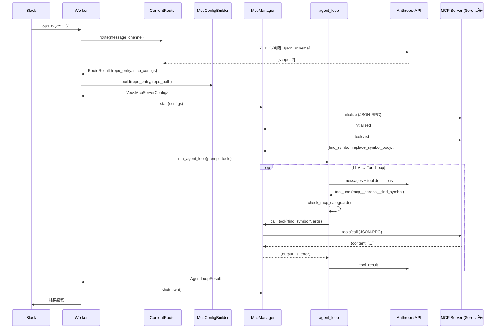

# Design: MCP ベース自律エージェントアーキテクチャへの移行

## 1. アーキテクチャ概要

### 現状アーキテクチャ

```
Slack / Asana
    ↓
Worker (ops queue / task queue)
    ↓
ClaudeRunner → AgentBackend (CLI / API / Bedrock)
    ↓
agent_loop.rs → dispatch_tool()
    ├── builtin: tool_impls.rs (Read/Write/Edit/Bash/Glob/Grep)
    └── MCP: McpManager → McpClient (JSON-RPC over stdio)
```

### 移行後アーキテクチャ

```
Slack / Asana
    ↓
Worker (ops queue / task queue)
    ↓
ContentRouter ─── LLM 分析 ──→ スコープ判定 + MCP サーバー選択
    ↓
ClaudeRunner → AgentBackend (API / Bedrock)     ← CLI 廃止
    ↓
agent_loop.rs → dispatch_tool()
    ├── builtin: tool_impls.rs (Bash のみ残存、safeguard 維持)
    └── MCP: McpManager → McpClient[]
            ├── Serena (セマンティックコード操作, filesystem 含む)
            ├── GitHub MCP Server (Issue/PR/Actions)
            ├── kintone MCP Server (レコード CRUD)
            └── (将来) gws MCP / Slack MCP
```

### 段階的移行フロー（NFR-2 対応）

```
Phase 0: ClaudeCliBackend 削除 + AGENT_BACKEND=max デフォルト化
Phase 1: Serena MCP 導入 → Read/Write/Edit/Glob/Grep を段階的に削除
Phase 2: GitHub MCP + kintone MCP 導入
Phase 3: コンテンツベースルーティングの MCP 対応強化
Phase 4: tool_impls.rs 最終縮小（Bash safeguard のみ残存）
```

## 2. コンポーネント設計

### 2.1 コンテンツベースルーター (ContentRouter)

**対応要件**: FR-2, FR-3

現在の `runner_ops.rs::route_ops()` を拡張し、メッセージ内容からスコープ判定だけでなく、使用する MCP サーバー群も動的に決定する。

```
                    ┌─────────────────────────┐
                    │      ContentRouter       │
                    │                          │
Slack msg ─────────→│ 1. key直接マッチ          │──→ RepoEntry
                    │ 2. LLM スコープ判定       │──→ RepoEntry + McpServerConfig[]
                    │ 3. MCP サーバー選択       │
                    └─────────────────────────┘
```

**責務**:
- 既存の `route_ops()` のロジックを ContentRouter 構造体に集約
- RepoEntry の `mcp_servers` フィールドから MCP サーバー設定を取得
- Serena の `--project` 引数をリポジトリパスから動的に構築

**インターフェース**:

```rust
pub struct ContentRouter {
    repos_config: ReposConfig,
    runner_ctx: RunnerContext,
}

pub struct RouteResult {
    pub repo_index: usize,
    pub repo_entry: RepoEntry,
    pub mcp_configs: Vec<McpServerConfig>,
}

impl ContentRouter {
    /// メッセージ内容からスコープ + MCP サーバー群を決定
    pub async fn route(&self, message: &str, channel: &str) -> Result<Option<RouteResult>>;
}
```

**既存コードとの統合**:
- `runner_ops.rs::resolve_ops_repo_entry()` 内の `route_ops()` 呼び出しを `ContentRouter::route()` に置き換え
- `route()` の返り値に `mcp_configs` を含めることで、`prepare_ops_execution()` が MCP サーバー設定を取得できる

### 2.2 MCP サーバー設定の動的構築 (McpConfigBuilder)

**対応要件**: FR-1, FR-3

repos.toml の `mcp_servers` フィールドからベース設定を読み込み、実行時にプロジェクトパス等を注入して McpServerConfig を構築する。

**責務**:
- Serena の `--project` 引数をリポジトリパスから動的に組み立て
- 環境変数の解決（kintone の API トークン等）
- デフォルト MCP サーバーの自動追加（全リポジトリ共通の Bash/filesystem）

**インターフェース**:

```rust
pub struct McpConfigBuilder;

impl McpConfigBuilder {
    /// RepoEntry + 実行時コンテキストから McpServerConfig[] を構築
    pub fn build(
        repo_entry: &RepoEntry,
        repo_path: &Path,
        extra_configs: &[McpServerConfig],
    ) -> Vec<McpServerConfig>;

    /// Serena の McpServerConfig を構築
    pub fn serena_config(repo_path: &Path) -> McpServerConfig;
}
```

**repos.toml の設定例**:

```toml
[[repo]]
key = "hikken_schedule"
github = "amu-tazawa-scripts/hikken_schedule"
ops_channel = "必見自動化"

[[repo.mcp_servers]]
name = "serena"
command = "uvx"
args = ["serena", "--context", "autonomous-agent"]
# --project は実行時に McpConfigBuilder が注入

[[repo.mcp_servers]]
name = "kintone"
command = "npx"
args = ["-y", "@anthropic/mcp-kintone"]
[repo.mcp_servers.env]
KINTONE_BASE_URL = "${KINTONE_BASE_URL}"
KINTONE_API_TOKEN = "${KINTONE_HIKKEN_TOKEN}"
```

### 2.3 AgentBackend の簡素化

**対応要件**: FR-5

`ClaudeCliBackend` を削除し、`AnthropicApiBackend` (OAuth) をデフォルトにする。

**変更点**:
- `src/claude.rs` から `ClaudeCliBackend` struct + impl を削除
- `src/main.rs::build_agent_backend()` の `"cli"` 分岐と API キーなし時のフォールバックを削除
- `AGENT_BACKEND` のデフォルトを `"max"` (OAuth) に変更
- `ClaudeRunner` から `--resume`, `--verbose`, `--output-format` 等 CLI 専用のロジックを除去

**移行後の `build_agent_backend()`**:

```rust
async fn build_agent_backend() -> Arc<dyn AgentBackend> {
    let backend_type = std::env::var("AGENT_BACKEND").unwrap_or_else(|_| "max".to_string());
    match backend_type.as_str() {
        "bedrock" => { /* 既存の Bedrock ロジック */ }
        _ => {
            // "max" or default: OAuth 認証
            // フォールバック: ANTHROPIC_API_KEY があれば API Key 認証
            match AnthropicApiBackend::from_env(model) {
                Ok(backend) => Arc::new(backend),
                Err(_) => {
                    let api_key = std::env::var("ANTHROPIC_API_KEY").unwrap_or_default();
                    Arc::new(AnthropicApiBackend::new(api_key, model))
                }
            }
        }
    }
}
```

### 2.4 tool_impls.rs の段階的縮小

**対応要件**: FR-1, NFR-1, NFR-2

Serena の autonomous-agent モードが提供する filesystem/bash 操作で builtin ツールを段階的に置き換える。

**Phase 1 での変更**:
- Serena MCP を有効化した実行では `Read/Write/Edit/Glob/Grep` を builtin ツール定義から除外
- Serena 未設定のリポジトリ（レガシー）では従来通り builtin を使用 → NFR-1 維持

**Phase 4 での最終形**:
- `tool_impls.rs` には `execute_bash()` + `check_dangerous_command()` のみ残存
- `tools.rs::build_tool_definitions()` は Bash のみ返す

**ツール選択ロジック** (`backend.rs` に追加):

```rust
fn resolve_tools(
    allowed_tools: Option<&str>,
    mcp_manager: Option<&McpManager>,
) -> Vec<ToolDefinition> {
    let mut tools = Vec::new();

    // MCP ツールがある場合、builtin の重複を除外
    if let Some(mgr) = mcp_manager {
        let mcp_tools = mgr.list_all_tools();
        let has_serena = mcp_tools.iter().any(|t| t.name.starts_with("mcp__serena__"));

        if has_serena {
            // Serena がある場合: Bash のみ builtin で追加
            tools.push(bash_tool());
        } else {
            // Serena なし: 全 builtin を追加
            tools.extend(build_tool_definitions(allowed_tools.unwrap_or("")));
        }
        tools.extend(mcp_tools);
    } else {
        // MCP なし: 全 builtin
        tools.extend(build_tool_definitions(allowed_tools.unwrap_or("")));
    }

    tools
}
```

### 2.5 セーフガードの MCP 対応

**対応要件**: FR-4

**二層防御モデル**:

```
Layer 1: agent_loop.rs (プロセス内フィルタ)
    ├── Bash: check_dangerous_command() — 既存のまま維持
    └── MCP: tool名 / 引数のバリデーション（新規）

Layer 2: MCP サーバー側 (プロセス外サンドボックス)
    ├── Serena: --project で操作範囲をリポジトリ内に制限
    └── filesystem: Serena の autonomous-agent モードが制御
```

**agent_loop.rs への追加**:

```rust
/// MCP ツール呼び出し前のセーフガード
fn check_mcp_safeguard(name: &str, input: &serde_json::Value) -> Option<String> {
    // Serena の bash_command ツール: builtin Bash と同じ safeguard を適用
    if name.ends_with("__bash_command") || name.ends_with("__execute_command") {
        if let Some(cmd) = input.get("command").and_then(|v| v.as_str()) {
            return check_dangerous_command(cmd).map(|r| r.to_string());
        }
    }
    None
}
```

## 3. データ設計

### 3.1 RepoEntry の拡張

**対応要件**: FR-1, FR-3

`repo_config.rs::RepoEntry` に MCP サーバー設定は既に存在する (`mcp_servers: Vec<McpServerConfig>`)。追加フィールドは不要。

### 3.2 McpServerConfig の環境変数テンプレート対応

現在の `McpServerConfig::env` は固定文字列。`${VAR_NAME}` パターンをサポートして実行時に環境変数を展開する。

```rust
impl McpServerConfig {
    /// env フィールドの ${VAR_NAME} を実際の環境変数値で展開
    pub fn resolve_env(&mut self) {
        for value in self.env.values_mut() {
            if let Some(var_name) = value.strip_prefix("${").and_then(|s| s.strip_suffix("}")) {
                if let Ok(resolved) = std::env::var(var_name) {
                    *value = resolved;
                }
            }
        }
    }
}
```

### 3.3 DB スキーマ変更

この設計ではDB スキーマの変更は不要。MCP サーバー設定は repos.toml に保持し、実行時に動的に構築する。

## 4. データフロー

### ops メッセージの処理フロー（移行後）



## 5. ファイル変更一覧

### 削除

| ファイル | 理由 |
|---------|------|
| `src/claude.rs` 内の `ClaudeCliBackend` | FR-5: CLI 依存を廃止 |
| `src/claude.rs` 内の `StreamEvent`, `ClaudeJsonResponse` 等 CLI パース関連 | 同上 |

### 新規作成

| ファイル | 責務 | 対応要件 |
|---------|------|---------|
| `src/worker/content_router.rs` | コンテンツベースルーティング | FR-2 |
| `src/anthropic/mcp_config.rs` | MCP 設定の動的構築 | FR-1, FR-3 |

### 変更

| ファイル | 変更内容 | 対応要件 |
|---------|---------|---------|
| `src/main.rs` | `build_agent_backend()` のデフォルトを max に変更, CLI フォールバック除去 | FR-5 |
| `src/claude.rs` | `ClaudeCliBackend` 削除, CLI 専用のストリーミング解析コード除去 | FR-5 |
| `src/anthropic/backend.rs` | `resolve_tools()` 追加: Serena 有無で builtin/MCP の切り替え | FR-1 |
| `src/anthropic/agent_loop.rs` | `check_mcp_safeguard()` 追加 | FR-4 |
| `src/anthropic/mcp.rs` | `McpServerConfig::resolve_env()` 追加 | FR-3 |
| `src/worker/runner_ops.rs` | `resolve_ops_repo_entry()` を ContentRouter に委譲 | FR-2 |
| `src/worker/ops.rs` | MCP サーバー設定を ClaudeRunner に渡す | FR-1 |
| `src/anthropic/tool_impls.rs` | Phase 1 では変更なし。Phase 4 で Read/Write/Edit/Glob/Grep 削除 | FR-1 |
| `src/anthropic/tools.rs` | Phase 4 で Bash のみに縮小 | FR-1 |
| `config/repos.toml` | `mcp_servers` セクションを各 repo に追加 | FR-1 |

## 6. NFR への対応

### NFR-1: 既存 ops の動作維持

- Phase 1 で Serena を導入しても、`mcp_servers` 未設定のリポジトリは従来通り builtin ツールを使用
- `resolve_tools()` が Serena の有無を動的に判定し、ツールセットを切り替え
- hikken_schedule, send_survey_mail, favorite_pop は Phase 1 完了後に個別に Serena を有効化

### NFR-2: 段階的移行

Phase ごとの移行計画:

| Phase | 内容 | リスク | ロールバック |
|-------|------|-------|------------|
| 0 | ClaudeCliBackend 削除 | 低: API backend は既に稼働中 | 環境変数で AGENT_BACKEND=cli に戻す (コード復元が必要) |
| 1 | Serena MCP 導入 (self リポジトリのみ) | 中: Serena の安定性未検証 | repos.toml から mcp_servers を削除で即ロールバック |
| 2 | GitHub/kintone MCP 追加 | 低: 既存 ops とは別パス | 同上 |
| 3 | ops リポジトリに Serena 展開 | 中: ops ワークフローへの影響 | repos.toml の mcp_servers 削除 |
| 4 | builtin ツール縮小 | 高: 全リポジトリに影響 | tool_impls.rs のコード復元 |

### NFR-3: トークン効率

- Serena の `find_symbol`, `get_symbol_details` でシンボル単位の読み込みが可能
- ファイル全体を `Read` で読む必要がなくなり、入力トークンを大幅削減
- 効果測定: `AgentLoopResult::total_usage` の比較で定量評価可能

## 7. ADR (Architecture Decision Records)

### ADR-0008: MCP ファーストアーキテクチャへの移行

**ステータス**: Proposed

**コンテキスト**:
ambient-task-agent は tool_impls.rs にハードコードされた 6 つの builtin ツール（Read/Write/Edit/Bash/Glob/Grep）に依存している。セマンティックなコード理解がなく、ファイル全体を読み込むためトークン効率が悪い。また、チャンネル固定のルーティングでは同一チャンネルの異なる依頼を正しく振り分けられない。

**検討した案**:

1. **Minimal案**: builtin ツールを維持しつつ、Serena を追加の MCP サーバーとして横並びに追加。コンテンツルーティングは既存の `route_ops()` をそのまま使用。
   - 利点: 変更が最小。既存コードへの影響がほぼない
   - 欠点: ツールの重複（builtin Read と Serena の read_file が共存）。LLM がどちらを使うか予測不能。トークン効率改善が限定的

2. **Clean案**: builtin ツールを全廃止し、全てのツール提供を MCP サーバーに移行。tool_impls.rs を削除。ContentRouter を独立モジュールとして大規模リファクタリング。
   - 利点: アーキテクチャがクリーン。ツール提供が完全に MCP に統一
   - 欠点: 一括移行は NFR-2 に違反。Bash safeguard の MCP 移行が複雑。全 ops の同時テストが必要

3. **Pragmatic案 (採用)**: Serena 有無で builtin/MCP を動的に切り替え。Phase 0-4 の段階的移行。Bash safeguard は builtin に残存。ContentRouter は `route_ops()` からの段階的抽出。
   - 利点: NFR-1/NFR-2 を満たす段階的移行。各 Phase でロールバック可能。既存 ops への影響を最小化
   - 欠点: 移行期間中は builtin + MCP の二重ロジックが存在

**決定**: Pragmatic案を採用。段階的移行により既存の ops 動作を維持しつつ、MCP ファーストアーキテクチャに移行する。

**根拠**:
- NFR-1 (既存 ops 維持) と NFR-2 (段階的移行) が最も重要な制約
- Minimal案ではツール重複の問題が解消されない
- Clean案は一括移行のリスクが高い
- Pragmatic案は各 Phase 単位でテスト・ロールバック可能

### ADR-0009: ClaudeCliBackend の廃止

**ステータス**: Proposed

**コンテキスト**:
`ClaudeCliBackend` は `claude -p` CLI を子プロセスとして実行する。`AnthropicApiBackend` (claude-auth crate 経由の OAuth) が安定稼働しており、CLI 依存の理由がなくなった。CLI 固有のバグ回避策（verbose JSON パース、`#36632` workaround 等）がコードを複雑にしている。

**検討した案**:

1. **CLI 残存案**: `ClaudeCliBackend` を残し、フォールバックとして維持。
   - 欠点: デッドコードの保守負担。MCP サーバー対応が CLI では困難（`--allowedTools` にMCPツール名を渡す制約）

2. **CLI 削除 + Bedrock フォールバック案 (採用)**: `ClaudeCliBackend` を完全削除。OAuth 失敗時は `ANTHROPIC_API_KEY` → Bedrock の順でフォールバック。
   - 利点: コードの大幅簡素化。MCP 対応が統一的に可能
   - リスク: OAuth トークンの有効期限切れ時にフォールバックが必要 → API Key 認証でカバー

**決定**: CLI 削除 + API Key / Bedrock フォールバック案を採用。

### ADR-0010: Bash safeguard を builtin に残存

**ステータス**: Proposed

**コンテキスト**:
Serena の autonomous-agent モードには `bash_command` / `execute_command` ツールが含まれる。しかし、`check_dangerous_command()` の safeguard ロジックは agent 側で制御する必要がある（MCP サーバー側では不十分）。

**決定**: Bash ツールは builtin (`tool_impls.rs`) に残存させ、MCP 経由の bash 系ツールにも同じ safeguard を `agent_loop.rs` で適用する。

**根拠**: セキュリティ制御はエージェント側（信頼境界の内側）で行うべき。MCP サーバーは外部プロセスであり、safeguard を移譲すると制御が分散する。

## 8. 既知の制約と今後の検討事項

### 解決済み

- **Serena の --project 動的切り替え**: `McpConfigBuilder` で実行時に引数を注入
- **ツール重複の回避**: `resolve_tools()` で Serena 有無に基づき builtin を除外
- **MCP セーフガード**: `check_mcp_safeguard()` で bash 系ツールに safeguard 適用

### 未解決（requirements.md の「既知の不足」に対応）

| 項目 | 現時点の方針 | 検討時期 |
|------|------------|---------|
| Google Workspace の MCP 化 | gws CLI (Bash 経由) のまま維持。Google 公式 MCP の成熟を待つ | Phase 2 以降 |
| Slack MCP の統合 | slack-socket crate のまま維持。Slack MCP は Bot 統合に不適 | 当面見送り |
| Max プランのレートリミット | `agent_loop` に指数バックオフ + Bedrock フォールバックを実装 | Phase 1 |

### Serena 固有の前提条件

- `uv` がインストール済みであること（mise shims 経由: `~/.local/share/mise/shims/uv`）
- 対象リポジトリの Language Server が利用可能であること
  - Rust: `rust-analyzer`（`rustup component add rust-analyzer` で導入済み）
  - Python: `pylsp`（`uv tool install python-lsp-server` で導入）
- Serena の初回起動時に Language Server のインデックス構築が必要（数十秒）

## 9. 要件追跡マトリクス

| 要件 | 対応コンポーネント | Phase |
|-----|-------------------|-------|
| FR-1: MCP サーバーによるツール提供 | McpConfigBuilder, resolve_tools(), repos.toml | 1-2 |
| FR-2: コンテンツベースルーティング | ContentRouter | 3 |
| FR-3: 動的プロジェクトコンテキスト | McpConfigBuilder (Serena --project 動的注入) | 1 |
| FR-4: セーフガードの MCP 対応 | check_mcp_safeguard(), tool_impls.rs (Bash 残存) | 1 |
| FR-5: claude-auth による LLM 呼び出し | build_agent_backend() 改修, ClaudeCliBackend 削除 | 0 |
| NFR-1: 既存 ops の動作維持 | resolve_tools() の動的切り替え | 全 Phase |
| NFR-2: 段階的移行 | Phase 0-4 の移行計画 | 全体 |
| NFR-3: トークン効率 | Serena のシンボルレベル操作 | 1 以降 |
